# `MacOS` 新系统配置


[toc]

---

## 一、前言

这个仓库适合作为 **macOS 新系统初始化入口**。目标不是做到真正无人值守，而是把新系统配置流程标准化：先装基础工具链，再安装开发工具，最后同步 JobsKits 相关仓库和个人环境配置。

当前脚本入口：

```shell
./'【MacOS】🆕新系统配置.command'
```

脚本当前主流程共 8 个阶段：

| 阶段 | 配置项 | 作用 |
|---:|---|---|
| 1 | Command Line Tools（CLT） | 提供 `git`、`clang`、基础编译工具链 |
| 2 | Xcode 模拟器配件 | 清理缓存并下载 iOS 模拟器平台组件 |
| 3 | oh-my-zsh | 安装 zsh 常用增强环境 |
| 4 | Homebrew | 安装或升级 macOS 包管理器 |
| 5 | brew 安装开发工具 | 安装常用 CLI、语言环境、图形应用 |
| 6 | npm | 安装 `quicktype` 等 Node 全局工具 |
| 7 | gem / CocoaPods | 通过 RubyGems 安装 `cocoapods` |
| 8 | Jobs | 同步 `JobsSoftware.MacOS`、`JobsMacEnvVarConfig` 并执行环境配置 |

脚本结束后会打开部分手动下载页面：

* Visual Studio Code
* Android Studio
* Python Downloads

---

## 二、总流程图

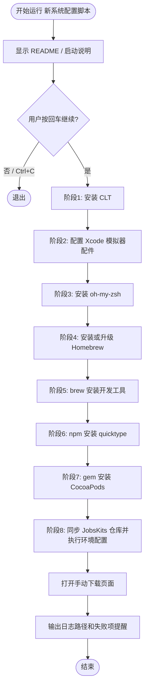

---

## 三、运行方式

### 3.1、授权并运行

```shell
chmod +x '【MacOS】🆕新系统配置.command'
./'【MacOS】🆕新系统配置.command'
```

也可以双击 `.command` 文件运行。

### 3.2、运行前检查

```shell
pwd
ls -la
```

建议把脚本放在你自己的系统配置仓库根目录。这样 README、脚本、日志说明、后续仓库同步逻辑都更容易管理。

### 3.3、日志文件

日志会写入 `/tmp`：

```shell
/tmp/【MacOS】🆕新系统配置.log
```

脚本真实日志文件名来自脚本文件名去掉扩展名后拼接 `.log`。

排查失败时先看终端最后一个 `✖`，再看日志：

```shell
cat /tmp/【MacOS】🆕新系统配置.log
```

---

## 四、系统配置阶段

### 4.1、阶段 1：Command Line Tools（CLT）

#### 4.1.1、目的

新系统第一步先装 Apple 命令行工具，否则后续 `git`、`clang`、编译工具链、Homebrew、RubyGems、CocoaPods 都可能不完整。

#### 4.1.2、流程图

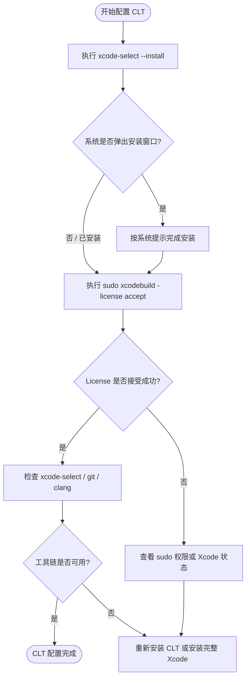

#### 4.1.3、脚本执行命令

```shell
xcode-select --install
sudo xcodebuild -license accept
```

#### 4.1.4、检查命令

```shell
xcode-select -p
git --version
clang --version
```

#### 4.1.5、常见问题

* `xcode-select --install` 提示已安装：正常，继续后续流程。
* `sudo xcodebuild -license accept` 失败：通常是未安装完整 Xcode、权限不足，或系统弹窗没有处理完。
* `git --version` 不可用：优先回到 CLT 安装，不要直接改后面的脚本。

---

### 4.2、阶段 2：Xcode 模拟器配件

#### 4.2.1、目的

清理 Xcode / Simulator 缓存，并重新下载 iOS 平台支持包。适合新系统、新 Xcode、模拟器异常、平台组件缺失等场景。

#### 4.2.2、流程图

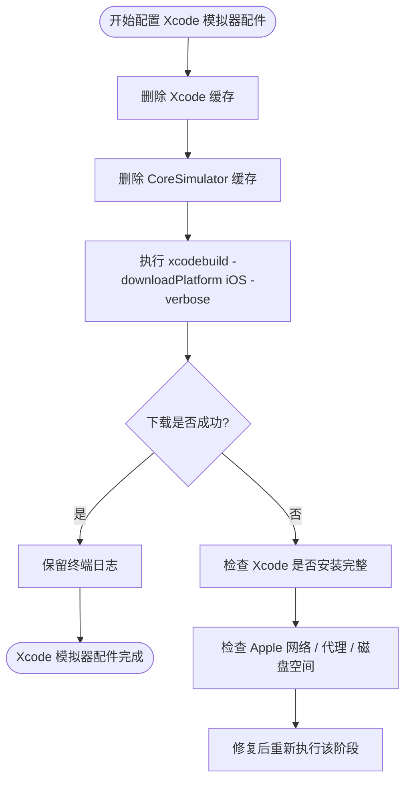

#### 4.2.3、脚本执行命令

```shell
rm -rf ~/Library/Caches/com.apple.dt.Xcode
rm -rf ~/Library/Developer/CoreSimulator/Caches
xcodebuild -downloadPlatform iOS -verbose
```

#### 4.2.4、适用场景

* 新系统首次安装 Xcode 后缺模拟器运行环境。
* Xcode 升级后模拟器缓存异常。
* `xcodebuild` 下载平台组件失败后需要重新拉取。

#### 4.2.5、常见问题

* 下载失败不一定是脚本问题，更多是 Xcode 未准备好、Apple 服务网络不稳定或磁盘空间不足。
* 如果 Xcode 没打开过，建议先手动打开一次 Xcode，让系统完成首次初始化。

---

### 4.3、阶段 3：oh-my-zsh

#### 4.3.1、目的

安装 oh-my-zsh，作为 zsh 的常用增强配置。macOS 当前默认 Shell 通常是 `zsh`，所以这个阶段优先级比较高。

#### 4.3.2、流程图

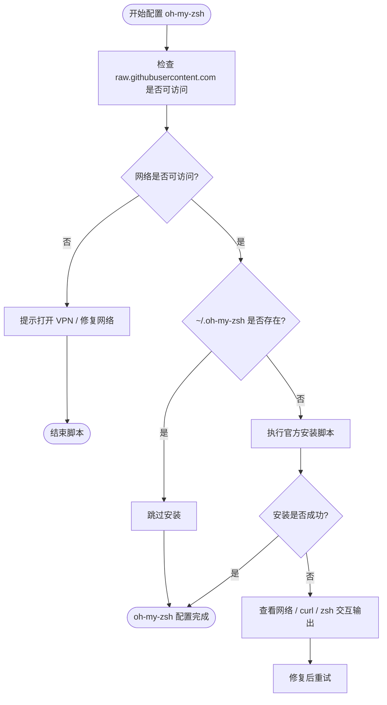

#### 4.3.3、脚本执行命令

```shell
sh -c "$(curl -fsSL https://raw.githubusercontent.com/ohmyzsh/ohmyzsh/master/tools/install.sh)"
```

#### 4.3.4、检查命令

```shell
ls -la ~/.oh-my-zsh
echo $SHELL
zsh --version
```

#### 4.3.5、常见问题

* 官方安装脚本可能有交互行为，这是正常的。
* 如果 `raw.githubusercontent.com` 不通，脚本会直接中断，不要把网络问题误判成脚本问题。

---

### 4.4、阶段 4：Homebrew

#### 4.4.1、目的

安装或升级 Homebrew。Homebrew 是后续安装 Node、Ruby、Python、fastlane、openjdk、ffmpeg、Flutter 等工具的基础。

#### 4.4.2、流程图

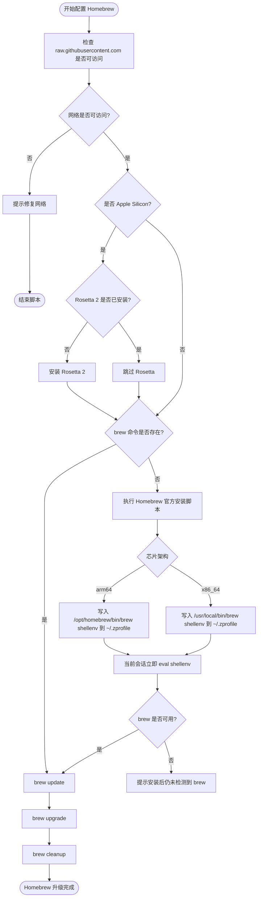

#### 4.4.3、脚本执行命令

安装：

```shell
/bin/bash -c "$(curl -fsSL https://raw.githubusercontent.com/Homebrew/install/HEAD/install.sh)"
```

Apple Silicon 环境变量：

```shell
eval "$(/opt/homebrew/bin/brew shellenv)"
```

Intel 环境变量：

```shell
eval "$(/usr/local/bin/brew shellenv)"
```

升级维护：

```shell
brew update
brew upgrade
brew cleanup
```

#### 4.4.4、检查命令

```shell
which brew
brew --version
brew doctor
```

#### 4.4.5、路径规则

| Mac 架构 | Homebrew 默认路径 |
|---|---|
| Apple Silicon / `arm64` | `/opt/homebrew/bin/brew` |
| Intel / `x86_64` | `/usr/local/bin/brew` |

#### 4.4.6、常见问题

* 双击 `.command` 时 PATH 可能不完整，所以脚本需要写入 `~/.zprofile` 并在当前进程立即生效。
* Apple Silicon 上部分 Intel 兼容工具依赖 Rosetta，脚本会自动检测并安装。
* Homebrew 不存在时是“安装”，存在时是“升级 + 清理”。这符合 `update` 类系统配置脚本的定位。

---

### 4.5、阶段 5：brew 安装开发工具

#### 4.5.1、目的

通过 Homebrew 安装新系统常用开发工具、语言环境、CLI 工具和部分图形应用。

#### 4.5.2、流程图

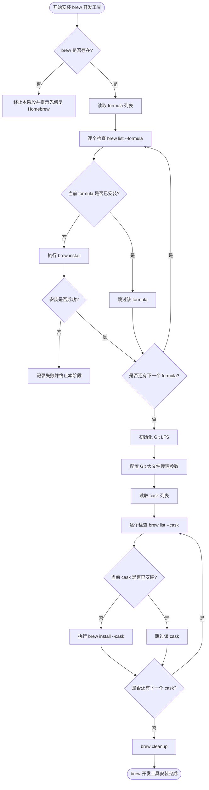

#### 4.5.3、Formula 工具清单

脚本意图安装的常用 formula：

```shell
brew install git-lfs
brew install gh
brew install nushell
brew install rbenv
brew install node
brew install jenv
brew install fvm
brew install pnpm
brew install ruby
brew install python
brew install python3
brew install fastlane
brew install mysql
brew install hugo
brew install openjdk
brew install openjdk@17
brew install yt-dlp
brew install ffmpeg
brew install go-task/tap/go-task
brew install uv
brew install fzf
```

#### 4.5.4、Cask 工具清单

脚本意图安装的图形应用：

```shell
brew install --cask hammerspoon
brew install --cask flutter
brew install --cask trex
brew install --cask vlc
```

#### 4.5.5、Git LFS 初始化

```shell
git lfs install
git config --global core.compression 0
git config --global http.postBuffer 524288000
```

#### 4.5.6、检查命令

```shell
brew list --formula
brew list --cask
git lfs version
gh --version
node -v
ruby -v
python3 --version
fastlane --version
java -version
ffmpeg -version
```

#### 4.5.7、脚本实现标准

新版脚本已经把 formula 和 cask 拆成两个数组：普通命令行工具只走 `brew install`，图形应用只走 `brew install --cask`。这样可以避免把 `--cask` 当成普通 formula 名称安装。

脚本中保持这种结构：

```zsh
local formulae=(
    git-lfs
    gh
    nushell
    rbenv
    node
    jenv
    fvm
    pnpm
    ruby
    python
    python3
    fastlane
    mysql
    hugo
    openjdk
    openjdk@17
    yt-dlp
    ffmpeg
    go-task/tap/go-task
    uv
    fzf
)

local casks=(
    hammerspoon
    flutter
    trex
    vlc
)
```

---

### 4.6、阶段 6：npm

#### 4.6.1、目的

通过 npm 安装 Node 生态的全局工具。目前脚本安装的是 `quicktype`。

#### 4.6.2、流程图

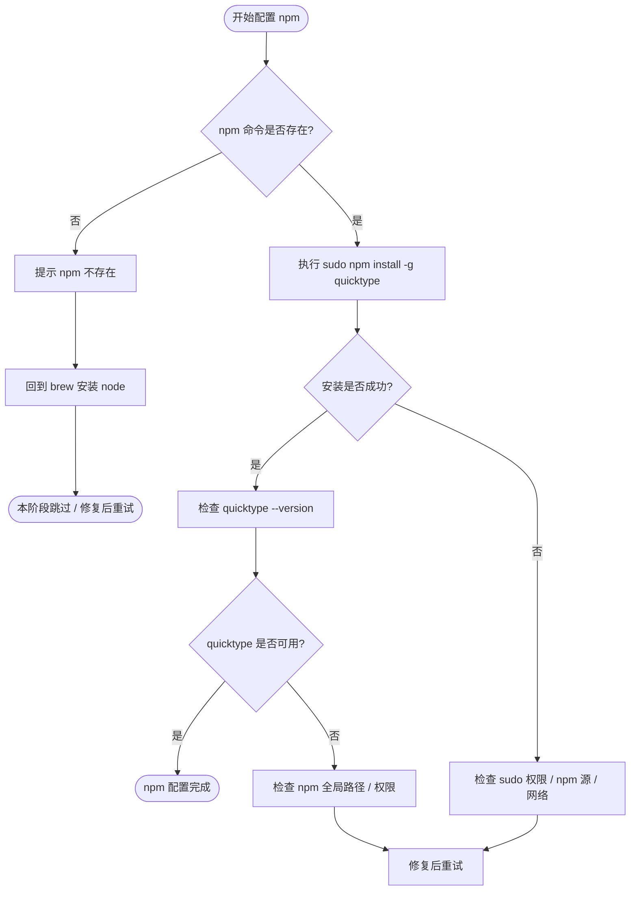

#### 4.6.3、脚本执行命令

```shell
sudo npm install -g quicktype
```

#### 4.6.4、检查命令

```shell
node -v
npm -v
quicktype --version
```

#### 4.6.5、常见问题

* `npm` 不存在：优先检查 `node` 是否通过 Homebrew 安装成功。
* `sudo npm install -g` 失败：常见原因是网络、权限、npm registry、全局目录权限。

---

### 4.7、阶段 7：gem / CocoaPods

#### 4.7.1、目的

通过 RubyGems 安装 CocoaPods。CocoaPods 是 iOS / macOS Objective-C / Swift 项目常用依赖管理工具，后续本地 pod、私有 pod、组件化仓库都会用到它。

#### 4.7.2、CocoaPods 安装流程图

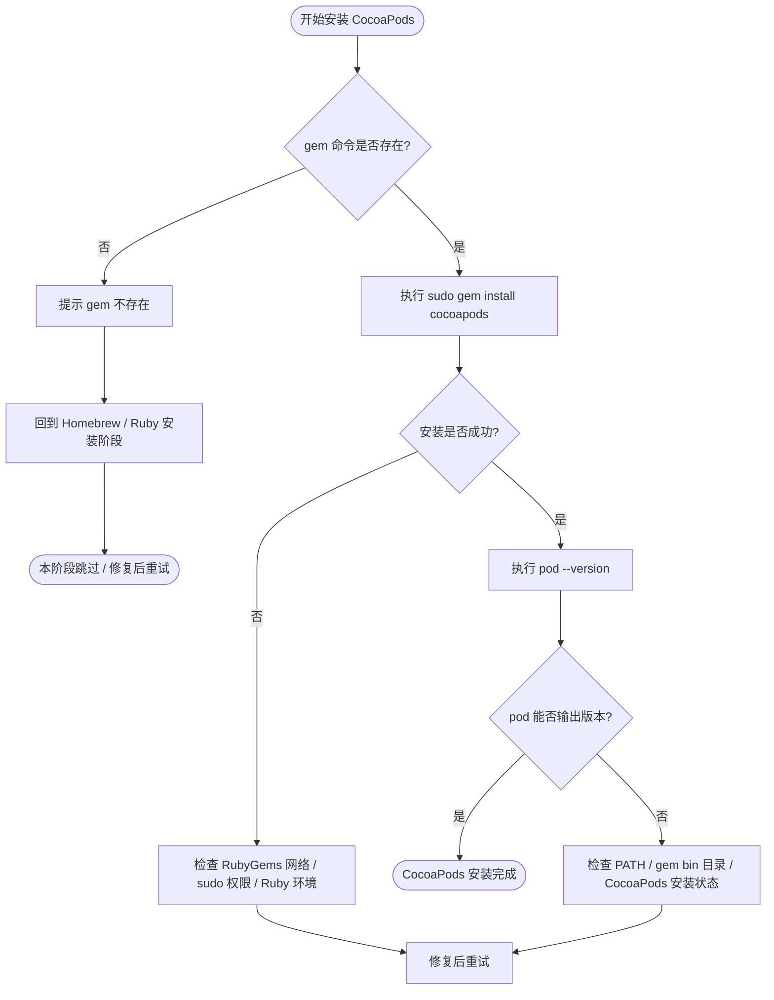

#### 4.7.3、脚本执行命令

```shell
sudo gem install cocoapods
```

#### 4.7.4、检查命令

```shell
ruby -v
gem -v
pod --version
which pod
```

#### 4.7.5、本地 pod 编译检查建议

如果你做的是本地管理的 pod，想确认 pod 内部是否能编译通过，建议按这个顺序查：

```shell
pod lib lint YourPod.podspec --allow-warnings --verbose
```

如果是私有源 / 本地依赖更多：

```shell
pod lib lint YourPod.podspec \
  --allow-warnings \
  --verbose \
  --no-clean
```

如果是要模拟发布前校验：

```shell
pod spec lint YourPod.podspec --allow-warnings --verbose
```

判断标准：

| 命令 | 用途 |
|---|---|
| `pod lib lint` | 本地开发阶段校验 podspec 和源码是否能集成编译 |
| `pod spec lint` | 发布前更严格校验，通常更接近远程发布场景 |
| `--no-clean` | 失败时保留临时工程，方便打开 Xcode 查错 |
| `--verbose` | 打印完整日志，别只看最后一行报错 |

---

### 4.8、阶段 8：JobsKits 仓库与环境配置

#### 4.8.1、目的

同步 JobsKits 相关仓库到本机，并执行环境变量配置脚本。

当前脚本涉及两个仓库：

```shell
https://github.com/JobsKits/JobsSoftware.MacOS.git
https://github.com/JobsKits/JobsMacEnvVarConfig.git
```

默认本地目录：

```shell
~/Desktop/JobsKits/JobsSoftware.MacOS
~/Desktop/JobsKits/JobsMacEnvVarConfig
```

#### 4.8.2、流程图

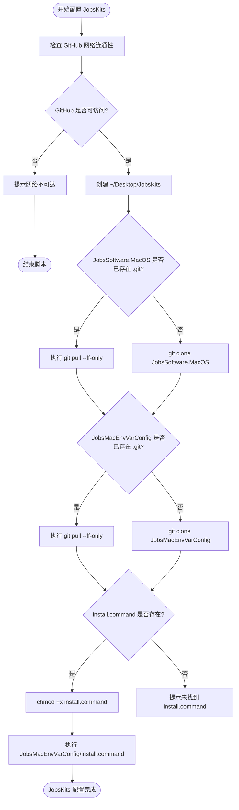

#### 4.8.3、脚本执行逻辑

```shell
mkdir -p ~/Desktop/JobsKits

git clone 'https://github.com/JobsKits/JobsSoftware.MacOS.git' '~/Desktop/JobsKits/JobsSoftware.MacOS'
git clone 'https://github.com/JobsKits/JobsMacEnvVarConfig.git' '~/Desktop/JobsKits/JobsMacEnvVarConfig'

chmod +x '~/Desktop/JobsKits/JobsMacEnvVarConfig/install.command'
~/Desktop/JobsKits/JobsMacEnvVarConfig/install.command
```

已存在仓库时不是重新 clone，而是：

```shell
git pull --ff-only
```

#### 4.8.4、检查命令

```shell
ls -la ~/Desktop/JobsKits
ls -la ~/Desktop/JobsKits/JobsSoftware.MacOS
ls -la ~/Desktop/JobsKits/JobsMacEnvVarConfig

git -C ~/Desktop/JobsKits/JobsSoftware.MacOS status
git -C ~/Desktop/JobsKits/JobsMacEnvVarConfig status
```

#### 4.8.5、常见问题

* GitHub 不通时脚本会结束，不会静默失败。
* `git pull --ff-only` 失败通常说明本地有分叉提交或未处理状态，先进入对应目录查 `git status`。
* `install.command` 不存在时，说明仓库内容、分支或拉取状态不符合预期。

---

## 五、手动下载环节

### 5.1、目的

这些软件体积大、安装包变化快，或者图形安装更稳，因此脚本只负责打开官网，不强行自动化安装。

### 5.2、流程图

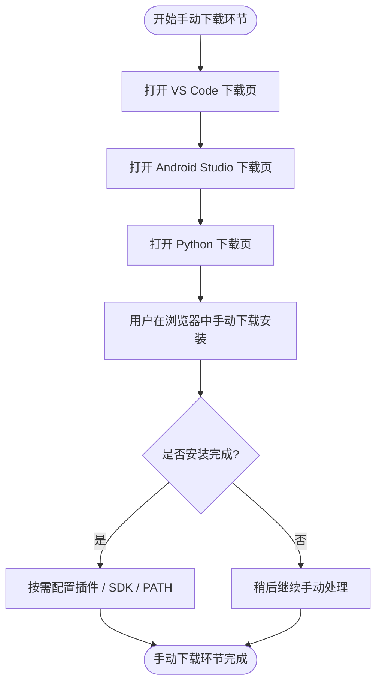

### 5.3、脚本打开页面

```url
https://code.visualstudio.com/
https://developer.android.com/studio?hl=zh-cn
https://www.python.org/downloads/
```

### 5.4、建议

* VS Code 可以配合 `VScodeConfigs` 或个人配置仓恢复插件和设置。
* Android Studio 体积大，且 SDK / 模拟器组件变化频繁，不建议硬塞进基础初始化脚本。
* Python 可以通过 Homebrew 或官网安装，最终取决于项目对 Python 版本的要求。

---

## 六、网络检查标准

### 6.1、GitHub 检查流程图

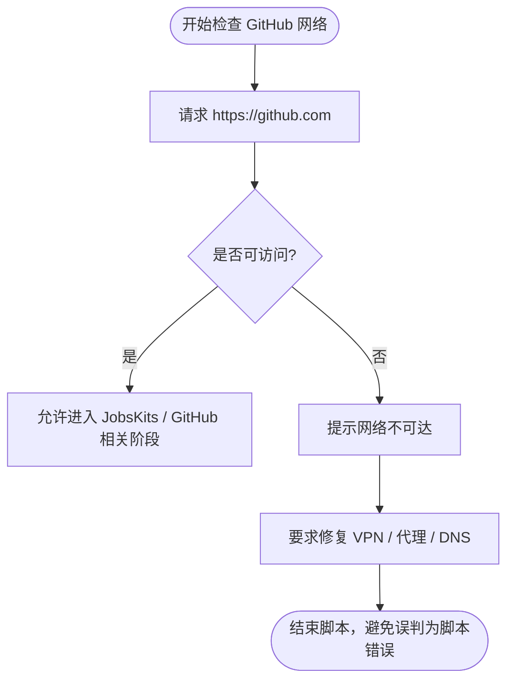

### 6.2、Homebrew / oh-my-zsh 检查流程图

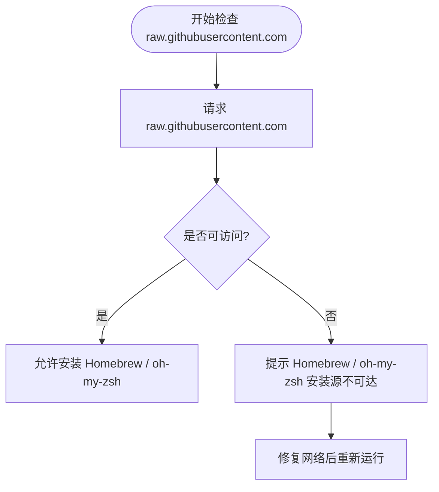

### 6.3、手动检查命令

```shell
curl -I -L https://github.com
curl -I -L https://raw.githubusercontent.com

git ls-remote https://github.com/JobsKits/JobsSoftware.MacOS.git
git ls-remote https://github.com/JobsKits/JobsMacEnvVarConfig.git
```

---

## 七、失败排查顺序

不要一上来改脚本，先按顺序查：

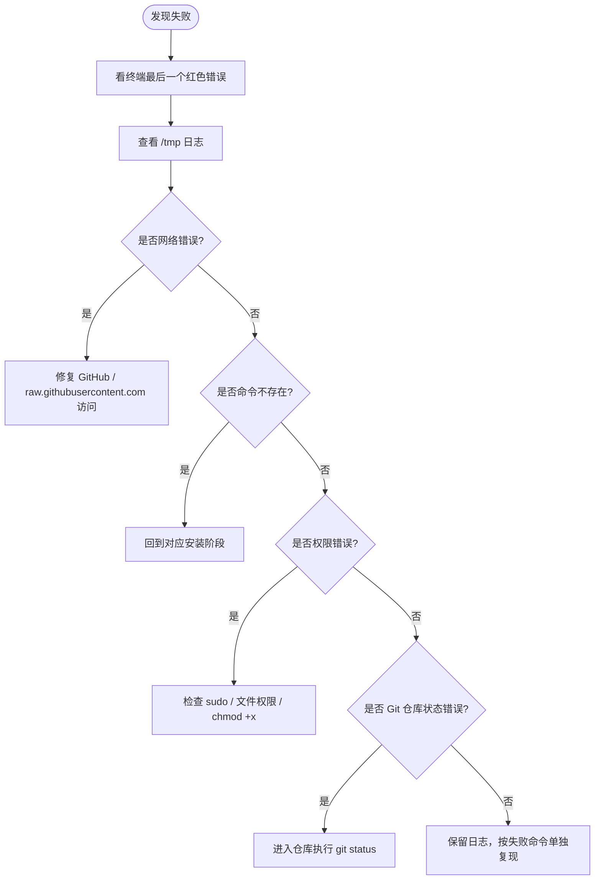

### 7.1、通用排查命令

```shell
cat /tmp/【MacOS】🆕新系统配置.log

which git
git --version

which brew
brew --version
brew doctor

which node
node -v
npm -v

which ruby
ruby -v
gem -v

which pod
pod --version
```

---

## 八、配置项 Mermaid 编写标准

以后 README 里每一个子项都按这个格式写：

```markdown
### N.x、配置项名称

#### 目的

说明为什么需要这个配置项。

#### 流程图

\```mermaid
flowchart TD
    A([开始]) --> B[检查前置条件]
    B --> C{是否满足?}
    C -- 是 --> D[执行安装 / 配置]
    C -- 否 --> E[提示修复]
    D --> F{是否成功?}
    F -- 是 --> G([完成])
    F -- 否 --> H[排查并重试]
\```

#### 命令

\```shell
xxx
\```

#### 检查

\```shell
xxx --version
\```

#### 常见问题

* 只写真实问题，不写废话。
```

标准要求：

* 每个配置项必须有 Mermaid 流程图。
* 流程图必须体现：开始、前置检查、是否已安装、执行动作、成功检查、失败排查。
* 安装类配置必须写检查命令。
* 涉及网络的配置必须写网络失败路径。
* 涉及删除、覆盖、升级、sudo 的配置必须写风险说明。
* README 不要只堆命令，要让以后回看时能知道为什么这样做。

---

## 九、当前脚本阶段和 README 对应关系

| 脚本函数 | README 章节 | Mermaid 是否已补齐 |
|---|---|---|
| `show_readme_and_block` | 三、运行方式 | 是 |
| `stage_clt` | 四 / 4.1、阶段 1：CLT | 是 |
| `stage_xcode_simulator_assets` | 四 / 4.2、阶段 2：Xcode 模拟器配件 | 是 |
| `stage_oh_my_zsh` | 四 / 4.3、阶段 3：oh-my-zsh | 是 |
| `stage_homebrew` | 四 / 4.4、阶段 4：Homebrew | 是 |
| `stage_brew_packages` | 四 / 4.5、阶段 5：brew 安装开发工具 | 是 |
| `stage_npm` | 四 / 4.6、阶段 6：npm | 是 |
| `stage_gem` | 四 / 4.7、阶段 7：gem / CocoaPods | 是 |
| `stage_jobs` | 四 / 4.8、阶段 8：JobsKits 仓库与环境配置 | 是 |
| `open_manual_download_pages` | 五、手动下载环节 | 是 |
| `finish_summary` | 七、失败排查顺序 | 是 |

---

## 十、设计原则

* 新系统配置先保证基础工具链，再同步个人配置。
* 网络不可达必须显式失败，不要假装成功。
* 每个子项都要能单独理解、单独排查、单独复现。
* Mermaid 流程图不是装饰，是为了让以后维护脚本时能看清执行分支。
* Homebrew 已存在时，执行更新、升级、清理是合理行为。
* `brew cleanup` 应作为常规清理动作，减少旧版本包和缓存垃圾。
* 涉及安装、升级、删除、sudo、网络的步骤，都要在 README 写清失败路径。
* CocoaPods 安装完成不代表本地 pod 可用，本地 pod 还要用 `pod lib lint` 单独验证。
* GitHub 网络问题和脚本逻辑问题必须分开判断。
* 脚本里能自动做的自动做，不能安全自动判断的要明确提示用户。

---

## 十一、FAQ

### 11.1、为什么 README 里每个子项都要画流程图？

因为新系统配置不是单条命令合集。每个配置项都有前置条件、成功路径、失败路径和检查标准。流程图能把这些分支固定下来，后面维护脚本时不容易改乱。

### 11.2、CocoaPods 的安装流程核心是什么？

核心是：先确认 `gem` 存在，再执行 `sudo gem install cocoapods`，最后用 `pod --version` 验证。不能只看 gem 安装结束就认为 CocoaPods 可用。

### 11.3、Homebrew 已经安装了，为什么脚本还要 update / upgrade / cleanup？

这是新系统配置和环境升级脚本，不是只安装缺失项。Homebrew 已存在时直接更新、升级、清理，符合这个脚本的目标。

### 11.4、GitHub 不通时为什么直接结束？

因为 JobsKits、oh-my-zsh、Homebrew 安装源都依赖外网。网络不通时继续跑只会制造更多误导错误，不如直接失败并提示修复网络。

### 11.5、为什么手动下载不全部自动化？

VS Code、Android Studio、Python 官网安装包变化快，Android Studio 还涉及 SDK、模拟器、授权协议。强行自动化不一定更稳，基础脚本只打开官网更可靠。

### 11.6、本地 pod 要怎么确认真的能编译？

优先执行：

```shell
pod lib lint YourPod.podspec --allow-warnings --verbose --no-clean
```

失败后打开 `--no-clean` 保留下来的临时工程，看 Xcode 编译错误，不要只看 CocoaPods 最后一行日志。

---

## 十二、后续建议

当前 README 已经按“每个子项都有 Mermaid 流程图”的标准升级完成，并且脚本本体已经同步修复 Homebrew formula / cask 分类问题。后续继续按这个标准维护：

1. 给安装 / 升级步骤增加更明确的用户交互策略。
2. 对危险操作保留强确认，例如输入 `YES`。
3. 保留 `brew cleanup` 作为普通清理项。
4. 后续新增任何配置项时，先补 README 流程图，再写脚本函数。

