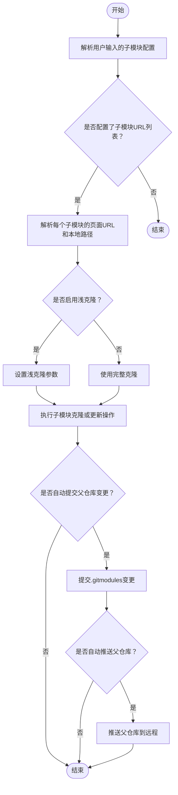

# `MacOS`新系统配置


[toc]

## 一、前言

* 做不到真正意义上的无人值守，但是可以把新系统配置流程标准化，减少重复操作，尽量平行各端环境。
* 本仓库更适合当作 **MacOS 新系统初始化入口**：先完成基础开发环境，再通过 `JobsKits` 相关子仓同步个人工具、环境变量、编辑器配置、快捷键配置、安装脚本等内容。
* 涉及 [**GitHub**](https://github.com/)  的步骤需要网络可达。中国大陆网络环境下，访问  [**GitHub**](https://github.com/) 可能出现阻塞、超时、拉取失败等情况，需要提前准备可用网络环境；网络不可达时，脚本应该明确报错，而不是静默失败。
* `【MacOS】⏬下载配置当前Git子模块.command` 是本仓库里用于统一下载、登记、更新 **Git** 子模块的核心脚本。它不是普通批量 `git clone` 下载器，而是围绕父 Git 仓库、`.gitmodules` 和 **submodule** **gitlink** 工作。

---

## 二、工作流程

### 2.1、<font color=red>C</font>ommand <font color=red>L</font>ine <font color=red>T</font>ools（CLT）

新系统第一步先装 Apple 命令行工具，否则后续 `git`、编译工具链、部分包管理器都可能不完整。

```shell
xcode-select --install
sudo xcodebuild -license accept
```

检查：

```shell
xcode-select -p
git --version
clang --version
```

---

### 2.2、Xcode 模拟器配件

清理 **Xcode** / **Simulator** 缓存后，重新下载 iOS 平台支持包：

```shell
rm -rf ~/Library/Caches/com.apple.dt.Xcode
rm -rf ~/Library/Developer/CoreSimulator/Caches

xcodebuild -downloadPlatform iOS -verbose
```

适用场景：

* 新系统首次安装 **Xcode** 后缺模拟器运行环境。
* **Xcode** 升级后模拟器缓存异常。
* `xcodebuild` 下载平台组件失败后需要重新拉取。

---

### 2.3、[ohMyZsh](https://ohmyz.sh/)

```shell
sh -c "$(curl -fsSL https://raw.[**GitHub**](https://github.com/) usercontent.com/ohmyzsh/ohmyzsh/master/tools/install.sh)"
```

说明：

* **MacOS** 当前默认 Shell 通常是 `zsh`。
* 后续 [**Homebrew**](https://brew.sh/) 环境变量一般写入 `~/.zprofile`，让新终端自动加载

---

### 2.4、[**Homebrew**](https://brew.sh/)

> [**Homebrew**](https://brew.sh/) 需要区分芯片架构。**Apple Silicon** 默认路径是 `/opt/Homebrew`，**Intel** 默认路径是 `/usr/local`。

手动安装命令：

```shell
/bin/bash -c "$(curl -fsSL https://raw.githubusercontent.com/Homebrew/install/HEAD/install.sh)"
```

安装完成后，**Apple Silicon** 常用环境变量：

```shell
eval "$(/opt/Homebrew/bin/brew shellenv)"
```

Intel 常用环境变量：

```shell
eval "$(/usr/local/bin/brew shellenv)"
```

常用维护命令：

```shell
brew update      # 更新 [**Homebrew**](https://brew.sh/) 自己的软件列表
brew upgrade     # 升级已经安装的软件
brew cleanup     # 清理旧版本缓存
brew doctor      # 检查 [**Homebrew**](https://brew.sh/) 健康状态
brew -v          # 查看版本
```

常用软件安装：

```shell
brew install node
brew install jenv
brew install fvm
brew install pnpm
brew install ruby
brew install python
brew install python3
brew install fastlane
brew install mysql
brew install hugo
brew install openjdk      # 最新 Java 环境
brew install openjdk@17
brew install fzf

brew install --cask hammerspoon
brew install --cask flutter

brew cleanup
```

> 注意：`【MacOS】⏬下载配置当前Git子模块.command` 在首次使用 `fzf` 前会自检 `fzf`。如果 `fzf` 不存在或不能正常响应，脚本会先自检 / 安装 [**Homebrew**](https://brew.sh/)，再通过 [**Homebrew**](https://brew.sh/) 安装或修复 `fzf`。所以在只运行该脚本的场景里，`fzf` 不一定需要提前手动安装。

---

### 2.5、[**npm**](https://www.npmjs.com/)

```shell
sudo npm install -g quicktype
```

检查：

```shell
node -v
npm -v
quicktype --version
```

---

### 2.6、[**gem**](https://guides.rubygems.org/)

```shell
sudo gem install cocoapods
```

检查：

```shell
ruby -v
gem -v
pod --version
```

---

### 2.7、[**JobsKits**](https://github.com/JobsKits/)

> 这一段是当前 README 的重点升级位置：不再建议手动一个个下载 [**JobsKits**](https://github.com/JobsKits/) 仓库，而是优先使用 `【MacOS】⏬下载配置当前Git子模块.command` 统一下载、登记、更新 Git 子模块。

#### 2.7.1、网络要求

需要访问：

```url
https://github.com/JobsKits/
```

中国大陆网络环境下，可能无法直接访问 [**GitHub**](https://github.com/) 。脚本执行到 [**GitHub**](https://github.com/)  拉取阶段时，如果网络不可达，应该明确报错。不要把网络阻塞误判为脚本逻辑问题。

常见检查命令：

```shell
git ls-remote https://github.com/JobsKits/JobsSoftware.MacOS.git
git ls-remote git@github.com:JobsKits/JobsSoftware.MacOS.git
```

**HTTPS** 能通说明浏览器 / **HTTPS clone** 路径可用；**SSH** 能通说明本机 **SSH Key**、[**GitHub**](https://github.com/)  账号授权和网络链路可用。

#### 2.7.2、推荐方式：运行子模块脚本

* `cd`进入父仓目录

* 授予执行权限并运行脚本：`chmod +x '【MacOS】⏬下载配置当前Git子模块.command'`

<font size=5 color=red>脚本启动后会自动切换到脚本所在目录，所以关键要求是：**脚本必须放在父 Git 仓库根目录下**。</font>

#### 2.7.3、当前默认纳入同步的 [**JobsKits**](https://github.com/JobsKits) 子仓

脚本顶部通过 `SUBMODULE_REPO_URLS` 管理目标子仓：

```zsh
SUBMODULE_REPO_URLS=(
  "https://github.com/JobsKits/JobsSoftware.MacOS|🔽JobsSoftware.MacOS"
  "https://github.com/JobsKits/JobsMacEnvVarConfig|🌍JobsMacEnvVarConfig"
  "https://github.com/JobsKits/JobsCodeSnippets|🍎JobsCodeSnippets"
  "https://github.com/JobsKits/JobsConfigHotKeyByHammerspoon|🔨JobsConfigHotKeyByHammerspoon"
  "https://github.com/JobsKits/JobsInstallOpenClaw|🦞JobsInstallOpenClaw"
  "https://github.com/JobsKits/SourceTree.sh|🌲SourceTree.sh"
  "https://github.com/JobsKits/VScodeConfigs|⚙️VScodeConfigs"
)
```

数组的配置原则：

* 只写 [**GitHub**](https://github.com/)  浏览器页面地址。
* 不写 `.git` 后缀。
* 不写 **SSH** 地址。
* 需要自定义本地目录名时，用 `|` 分隔。

正确：

```zsh
"https://github.com/JobsKits/JobsGenesis"
"https://github.com/JobsKits/JobsSoftware.MacOS|🔽JobsSoftware.MacOS"
```

不要写：

```zsh
"https://github.com/JobsKits/JobsGenesis.git"
"git@github.com:JobsKits/JobsGenesis.git"
```

脚本会自动把页面地址**推导**成两种 clone 地址：

* 页面地址：    `https://github.com/JobsKits/JobsGenesis`
* HTTPS clone：`https://github.com/JobsKits/JobsGenesis.git`
* SSH clone： `git@github.com:JobsKits/JobsGenesis.git`

---

## 三、`【MacOS】⏬下载配置当前Git子模块.command` 详细说明

### 3.1、流程简述



### 3.2、脚本定位

该脚本用于管理当前父 **Git** 仓库下的子模块。它会根据脚本顶部 `SUBMODULE_REPO_URLS` 中的配置完成以下工作：

* 生成 **HTTPS / SSH** 两套 clone URL。
* 检查和补齐 `.gitmodules`。
* 下载缺失子仓。
* 更新已有子仓到远端最新提交。
* 把子仓登记成标准 **Git submodule**。
* 更新父仓里的 `.gitmodules` 和 **submodule gitlink**。
* 根据配置决定是否自动提交、是否自动 push 父仓。

重点：它不是单纯把多个仓库 clone 到本地，而是把它们纳入当前父仓的 Git 子模块体系。

---

### 3.3、脚本放置位置

* 推荐结构：

  ```
  JobsConfigOS/
  ├── 【MacOS】⏬下载配置当前Git子模块.command
  ├── README.md
  ├── .git/
  ├── .gitmodules
  ├── 🔽JobsSoftware.MacOS/
  ├── 🌍JobsMacEnvVarConfig/
  ├── 🍎JobsCodeSnippets/
  ├── 🔨JobsConfigHotKeyByHammerspoon/
  ├── 🦞JobsInstallOpenClaw/
  ├── 🌲SourceTree.sh/
  └── ⚙️VScodeConfigs/
  ```

* 脚本内部会根据自身路径执行类似逻辑：`cd 脚本所在目录`。所以不要把脚本放到子目录里再运行，否则它会把那个子目录当成父仓。

---

### 3.4、启动后的主菜单

* 脚本使用 `fzf` 渲染主菜单：

  ```
  全量同步更新下载到最新
  选择指定子模块同步（可多选）
  只更新目前已有的
  添加并同步一个新的 Git 地址
  退出
  ```

* 菜单上方预览区会展示：

  * 脚本目录。
  * 当前目录。
  * 父仓远端名。
  * 子模块优先分支。
  * 当前 URL 模式。
  * `.gitmodules` 补缺 URL 模式。
  * 是否干跑。
  * 是否自动提交父仓。
  * 是否自动推送父仓。
  * 是否启用浅克隆。
  * 当前配置的目标子 Git 列表。
  * 每个目标子 Git 的 page / https / ssh 地址。
  * `.gitmodules` 是否已有对应条目。
  
* 预览区快捷键：

  | 按键       | 作用           |
  | ---------- | -------------- |
  | `Ctrl + K` | 预览区上滚一行 |
  | `Ctrl + J` | 预览区下滚一行 |
  | `Ctrl + U` | 预览区上翻页   |
  | `Ctrl + D` | 预览区下翻页   |

---

### 3.5、菜单动作：全量同步更新下载到最新

* 适合：

  * 第一次配置新 Mac。
  * 当前父仓里子模块目录缺失较多。
  * 想按脚本顶部数组重新刷新所有目标子仓。

* 执行逻辑：

  * 对 `.gitmodules` 做一次查漏补缺。

  * 收集需要删除的目标目录，包括配置里的本地目录、仓库名目录、当前父仓下已经存在的 Git 子目录。

  * 对每个待删除目录做安全检查。

  * 删除可安全删除的目标目录。

  * 按 `SUBMODULE_REPO_URLS` 重新 clone。

  * 同步每个子仓到目标分支最新提交。

  * 执行 `git submodule absorbgitdirs`，整理成标准 submodule 形态。

  * `git add` `.gitmodules` 和对应子模块 gitlink。

  * 按 `AUTO_PARENT_COMMIT` 决定是否自动提交父仓。

  * 按 `AUTO_PARENT_PUSH` 决定是否自动 push 父仓。

* 安全边界：

  * 子仓存在未提交内容时，终止更新或删除。
  * 非 Git 且非空目录默认不删除。
  * 空目录可以删除。
  * 需要强制删除非 Git 且非空目录时，必须显式设置 `FORCE_DELETE=1`。

---

### 3.6、菜单动作：选择指定子模块同步（可多选）

* 这个二级页面不使用 `fzf` 的多选模式，而是使用类似 [**OpenClaw**](https://github.com/openclaw/openclaw) 引导菜单的键盘交互。

* 按键说明：

  | 按键      | 作用                    |
  | --------- | ----------------------- |
  | `↑` / `↓` | 移动光标                |
  | `Enter`   | 勾选 / 取消勾选当前项目 |
  | `Space`   | 确认当前勾选并开始同步  |
  | `←`       | 返回上一页              |
  | `Esc`     | 停止脚本                |
  | `j` / `k` | 兼容下移 / 上移         |
  | `h` / `H` | 兼容返回上一页          |

  第一项是 **全选**：`全选：同步 SUBMODULE_REPO_URLS 中全部项目`


* 行为规则：

  * 光标停在“全选”上按 `Enter`：全选或取消全选。
  * 光标停在具体子仓上按 `Enter`：单独勾选或取消。
  * 按 `Space`：同步已勾选项目。
  * 没有勾选任何项目时按 `Space`：不会执行同步，会提示先勾选。
  * 按 `←`：返回主菜单。
  * 按 `Esc`：停止脚本，不再作为返回上一页。

---

### 3.7、菜单动作：只更新目前已有的

* 适合日常增量更新。

* 它只处理当前本地已经存在、并且在 `SUBMODULE_REPO_URLS` 中配置过的 **Git** 子目录。

* | 当前状态                      | 脚本行为                     |
  | ----------------------------- | ---------------------------- |
  | 存在部分已配置子 Git 目录     | 只更新这些已经存在的目录     |
  | 一个已配置子 Git 目录都不存在 | 自动切换为全量同步           |
  | 某个已存在子仓有未提交内容    | 终止该子仓更新               |
  | 存在未配置的 Git 子目录       | 不作为“只更新目前已有的”目标 |

  这个选项不会把所有缺失子仓都补回来。需要补齐全部项目时，使用**全量同步更新下载到最新**

---

### 3.8、菜单动作：添加并同步一个新的 Git 地址

* 适合临时添加一个新 **JobsKits** 子仓并立即同步。

* 支持输入三种格式，例如：

  ```
  https://github.com/JobsKits/JobsGenesis
  https://github.com/JobsKits/JobsGenesis.git
  git@github.com:JobsKits/JobsGenesis.git
  ```

* 校验规则
  * 必须能解析为 [**GitHub**](https://github.com/)  的 `owner/repo`。
  * 根据当前 URL 模式生成 clone URL。
  * 必须通过 `git ls-remote` 访问校验。
  * 输入不合法或不可访问，会继续追问。
  * 输入一个空格后回车，返回上一页。`[Space][Enter]`

* 注意：这个菜单添加的新仓只在本次运行期间追加到内存配置。同步完成后，脚本会提示类似：

  ```
  "https://github.com/JobsKits/JobsGenesis"
  ```

* 需要长期保留时，把这行手动加入脚本顶部 `SUBMODULE_REPO_URLS`。

---

### 3.9、[**Homebrew**](https://brew.sh/)/[**fzf**](https://junegunn.GitHub .io/fzf/) 自检

* 脚本在第一次使用 `fzf` 前会自检。

* `fzf` 健康标准：

  ```zsh
  command -v fzf
  fzf --version
  ```

  同时满足才视为健康。

* `fzf` 不健康时，脚本会：

  * 查找 [**Homebrew**](https://brew.sh/)

  * [**Homebrew**](https://brew.sh/) 不存在时，按当前芯片架构安装

  * [**Homebrew**](https://brew.sh/) 存在时，确认 `brew --version` 能正常响应

  * 询问是否执行

    ```zsh
    brew update && brew upgrade && brew cleanup && brew doctor && brew -v
    ```

  * 通过 [**Homebrew**](https://brew.sh/) 安装或重新安装 `fzf`。

  * 再次检查 `fzf --version`。

* [**Homebrew**](https://brew.sh/) 路径规则

  | Mac 架构                | [**Homebrew**](https://brew.sh/) 路径 |
  | ----------------------- | ------------------------------------- |
  | Apple Silicon / `arm64` | `/opt/Homebrew/bin/brew`              |
  | Intel / `x86_64`        | `/usr/local/bin/brew`                 |

  当前脚本会把 [**Homebrew**](https://brew.sh/) shellenv 写入 `~/.zprofile`，并尽量在当前脚本进程中立即生效

---

### 3.10、HTTPS / SSH 自动适配

> 设计目标：同一个脚本换到另一台电脑，只要父仓 `origin` 协议不同，子仓同步协议就自动跟着变，不需要每次运行前手动拼一长串环境变量。

* 默认配置

  ```zsh
  GIT_URL_STYLE="${GIT_URL_STYLE:-auto}"
  ```

* `auto` 模式会读取父仓远端

  ```zsh
  git remote get-url origin
  ```

* 然后判断子仓同步协议

  | 父仓 origin                      | 子仓同步协议 |
  | -------------------------------- | ------------ |
  | `git@GitHub.com:xxx/yyy.git`     | **SSH**      |
  | `ssh://...`                      | **SSH**      |
  | `https://GitHub.com/xxx/yyy.git` | **HTTPS**    |
  | 无法判断                         | **HTTPS**    |

* 日常不需要手动写

  ```
  GIT_URL_STYLE=ssh ./【MacOS】⏬下载配置当前Git子模块.command
  ```

* 只有需要临时强制覆盖自动判断时，再使用

  ```
  GIT_URL_STYLE=ssh ./【MacOS】⏬下载配置当前Git子模块.command
  GIT_URL_STYLE=https ./【MacOS】⏬下载配置当前Git子模块.command
  ```

---

### 3.11、`.gitmodules` 管理策略

* 脚本会对 `.gitmodules` 做“查漏补缺”，不是无脑重写整个文件。

  * 会自动做：
    * `.gitmodules` 不存在时创建空文件。
    * `SUBMODULE_REPO_URLS` 中有、`.gitmodules` 缺失的条目会补齐。
    * `.gitmodules` 中 path 不正确时修正 path。
    * `.gitmodules` 中 url 指向错误仓库时修正 url。
    * `.gitmodules` 中 branch 不等于 `SUBMODULE_BRANCH` 时修正 branch。

  * 不会默认做：
    * 从 `SUBMODULE_REPO_URLS` 删除某一行后，不会立刻删除 `.gitmodules` 里的旧配置段。

* 当前脚本默认值：

  ```zsh
  PRUNE_STALE_GITMODULES="${PRUNE_STALE_GITMODULES:-0}"
  ```

* 需要清理 `.gitmodules` 中已经不在配置数组里的旧子模块时，显式运行：

  ```
  PRUNE_STALE_GITMODULES=1 ./【MacOS】⏬下载配置当前Git子模块.command
  ```

* 清理旧子模块仍然遵守安全规则：

  * 子仓有未提交内容：终止。
  * 非 Git 且非空目录：默认拒绝删除。
  * 需要删除非 Git 且非空目录：额外设置 `FORCE_DELETE=1`。

* `.gitmodules` 的协议和实际同步协议

  这两个概念分开处理：

  * `.gitmodules` 是跨机器共享配置文件。
  * 实际 clone / fetch / remote set-url 使用父仓 `origin` 推导出来的 HTTPS / SSH。

  因此：

  * `.gitmodules` 已有合法 HTTPS 地址时，不会因为当前父仓是 SSH 就强行改成 SSH。
  * `.gitmodules` 的 URL 只要指向同一个 [**GitHub**](https://github.com/)  仓库，就视为合法。
  * `.gitmodules` 的 URL 指向错误仓库时才修正。
  * `.gitmodules` 缺失条目会按当前 `.gitmodules` 已有条目的协议风格补齐；文件为空时默认用 HTTPS。

  这样可以减少跨机器协作时 `.gitmodules` 的无意义改动。

---

### 3.12、子仓同步策略

* 默认优先分支：

  ```zsh
  SUBMODULE_BRANCH="${SUBMODULE_BRANCH:-main}"
  ```

* 如果远端没有 `main`，脚本会尝试读取远端默认分支。

  * 默认浅克隆：

    ```zsh
    SUBMODULE_SHALLOW_CLONE="${SUBMODULE_SHALLOW_CLONE:-1}"
    SUBMODULE_DEPTH="${SUBMODULE_DEPTH:-1}"
    ```
  
  * 效果类似：
  
    ```zsh
    git clone --depth 1 --single-branch --shallow-submodules
    ```
  
  * 默认不拉 tags：
  
    ```zsh
    SUBMODULE_FETCH_TAGS="${SUBMODULE_FETCH_TAGS:-0}"
    ```
  
    适用目标：配置仓、脚本仓、软件包仓。优点是快，缺点是本地历史不完整。
  
  * 需要完整历史：
  
    ```zsh
    SUBMODULE_SHALLOW_CLONE=0 ./【MacOS】⏬下载配置当前Git子模块.command
    ```
  
  * 需要 tags：
  
    ```zsh
    SUBMODULE_FETCH_TAGS=1 ./【MacOS】⏬下载配置当前Git子模块.command

---

### 3.13、父仓处理策略

> 脚本把自身所在目录视为父仓

* 父仓不是 Git 仓库时：

  ```zsh
  git init
  ```

* 父仓没有 `origin` 时，脚本会循环要求输入远端地址，并通过 `git ls-remote` 校验可访问后添加。

* 父仓分支默认使用：`main`

  * 处理规则：

    * 本地已有 `main`：切过去。
    * 远端有 `main`：基于远端创建 / 跟踪。
    * 都没有：创建本地 `main`。

* 父仓存在未提交变更时，脚本会跳过（原因很直接：自动 rebase 容易带来冲突，脚本不会替用户处理父仓未提交内容。）

  ```
  git pull --rebase
  ```

  * 默认自动提交：

    ```
    AUTO_PARENT_COMMIT="${AUTO_PARENT_COMMIT:-1}"
    ```

  * 默认不自动推送：

    ```
    AUTO_PARENT_PUSH="${AUTO_PARENT_PUSH:-0}"
    ```

  * 自动提交的内容主要是：

    * `.gitmodules`
    * 子模块 gitlink

  * 提交信息格式：

    ```
    chore: sync git submodules (https)
    chore: sync git submodules (ssh)
    ```

---

### 3.14、安全机制

#### 3.14.1、子仓有未提交内容时不更新、不删除

* 脚本检查

  ```zsh
  git -C 子仓目录 status --porcelain --untracked-files=normal
  ```

  只要有输出，就认为该子仓不干净，包括：

  * 已修改未提交文件。
  * 新增未跟踪文件。
  * staged 但未提交文件。

* 处理方式由用户自己决定

  ```shell
  cd 子仓目录
  git status
  ```

  * 保留改动

    ```
    git add .
    git commit -m "..."
    ```

  * 明确丢弃改动

    ```
    git reset --hard
    git clean -fd
    ```

  <font color=red size=15>**脚本不会替用户丢弃改动**</font>

#### 3.14.2、非 Git 非空目录默认不删

* 如果目标目录存在，但不是 Git 工作区，也不是空目录，脚本默认拒绝覆盖或删除。

* 强制删除需要显式打开

  > 这个开关只适合确认目录可以删除的场景，不建议作为日常默认参数。

  ```zsh
  FORCE_DELETE=1 ./【MacOS】⏬下载配置当前Git子模块.command
  ```

---

### 3.15、环境变量开关

| 变量 | 默认值 | 说明 |
|---|---:|---|
| `SUBMODULE_BRANCH` | `main` | 子模块优先同步分支；远端没有时使用远端默认分支 |
| `REMOTE_NAME` | `origin` | 父仓远端名 |
| `DRY_RUN` | `0` | `1` 表示只打印动作，尽量不执行写操作 |
| `FORCE_DELETE` | `0` | `1` 允许删除非 Git 且非空冲突目录 |
| `AUTO_PARENT_COMMIT` | `1` | `1` 自动提交 `.gitmodules` / gitlink 变化 |
| `AUTO_PARENT_PUSH` | `0` | `1` 自动 push 父仓 |
| `GIT_URL_STYLE` | `auto` | `auto` / `https` / `ssh`；默认继承父仓 origin 协议 |
| `PRUNE_STALE_GITMODULES` | `0` | `1` 删除 `.gitmodules` 中已不在配置数组里的旧子模块 |
| `SUBMODULE_SHALLOW_CLONE` | `1` | `1` 启用浅克隆；`0` 完整克隆 |
| `SUBMODULE_DEPTH` | `1` | 浅克隆深度 |
| `SUBMODULE_FETCH_TAGS` | `0` | `1` 拉取 tags；默认不拉 |

常用组合：

```shell
# 只预览，不执行写操作
DRY_RUN=1 ./【MacOS】⏬下载配置当前Git子模块.command

# 强制使用 SSH
GIT_URL_STYLE=ssh ./【MacOS】⏬下载配置当前Git子模块.command

# 同步完成后自动 push 父仓
AUTO_PARENT_PUSH=1 ./【MacOS】⏬下载配置当前Git子模块.command

# 清理 .gitmodules 中不再配置的旧子模块
PRUNE_STALE_GITMODULES=1 ./【MacOS】⏬下载配置当前Git子模块.command

# 完整 clone 子仓并拉 tags
SUBMODULE_SHALLOW_CLONE=0 SUBMODULE_FETCH_TAGS=1 ./【MacOS】⏬下载配置当前Git子模块.command
```

日常推荐直接运行：

```shell
./'【MacOS】⏬下载配置当前Git子模块.command'
```

其他环境变量只在特殊场景临时打开。

---

### 3.16、📔日志文件

* 脚本每次运行都会写日志到：`/tmp/【MacOS】⏬下载配置当前Git子模块.log`

* 实际文件名来自脚本文件名去掉扩展名后拼接 `.log`。

* 排查失败时优先看终端最后一个 `❌`，需要完整记录时再看 `/tmp` 下的日志。

---

### 3.17、常见使用场景

#### 场景 1：新 Mac 第一次拉完整配置

> 父仓是 **SSH**，子仓自动用 **SSH**；父仓是 **HTTPS**，子仓自动用 **HTTPS**。

* 授权并运行脚本`【MacOS】⏬下载配置当前Git子模块.command`

* 菜单选择：`全量同步更新下载到最新`

#### 场景 2：日常只更新本地已有子仓

* 运行脚本后选择：`只更新目前已有的`
* 该选项不会下载所有缺失子仓，适合日常增量同步。

#### 场景 3：只同步几个指定子仓

* 运行脚本后选择：`选择指定子模块同步（可多选）`

* 进入二级页面后：
  * `↑` / `↓` 移动
  * `Enter` 勾选
  * `Space` 确认后开始同步
  * `←` 返回主菜单

#### 场景 4：临时添加一个新仓

* 运行脚本后选择：`添加并同步一个新的 Git 地址`

* 同步完成后，把脚本提示的配置行加入 `SUBMODULE_REPO_URLS`，下次运行才会长期保留。

#### 场景 5：删除一个不再需要的子模块

* 从 `SUBMODULE_REPO_URLS` 删除对应行。

* 使用清理模式运行：

  ```
  PRUNE_STALE_GITMODULES=1 ./【MacOS】⏬下载配置当前Git子模块.command
  ```

* 菜单选择全量同步或只更新已有。

* 检查父仓变更

  ```zsh
  git status
  git diff --cached -- .gitmodules
  ```

**旧目录不是 Git 目录且非空时，脚本会拒绝删除。确认要删时，再额外加 `FORCE_DELETE=1`**

---

### 3.18、失败排查顺序

按下面顺序查，别一上来改脚本：

1. 看终端最后一个 `❌` 报错。
2. 看日志：

   ```shell
   cat /tmp/【MacOS】⏬下载配置当前Git子模块.log
   ```

3. 检查父仓状态：

   ```shell
   git status
   git remote -v
   git branch --show-current
   ```

4. 检查子仓是否有未提交内容：

   ```shell
   git -C 子仓目录 status
   ```

5. 检查父仓协议判断依据：

   ```shell
   git remote get-url origin
   ```

6. 单独检查 [**GitHub**](https://github.com/)  访问：

   ```shell
   git ls-remote https://[**GitHub**](https://github.com/) .com/JobsKits/JobsSoftware.MacOS.git
   git ls-remote git@[**GitHub**](https://github.com/) .com:JobsKits/JobsSoftware.MacOS.git
   ```

7. 临时强制协议再试：

   ```shell
   GIT_URL_STYLE=ssh ./【MacOS】⏬下载配置当前Git子模块.command
   GIT_URL_STYLE=https ./【MacOS】⏬下载配置当前Git子模块.command
   ```

8. 只预览脚本动作：

   ```shell
   DRY_RUN=1 ./【MacOS】⏬下载配置当前Git子模块.command
   ```

---

### 3.19、<font color=red>F</font><font color=blue>A</font><font color=green>Q</font>

#### 3.19.1、为什么 `.gitmodules` 里还是 HTTPS，但父仓是 SSH？

* 这是正常设计。

  `.gitmodules` 是跨机器共享配置。脚本不会因为当前机器父仓是 SSH，就强行把已有合法 HTTPS 条目改成 SSH。实际同步时，脚本会把子仓 `origin` 改成当前机器应该使用的协议。

#### 3.19.2、为什么删除了 `SUBMODULE_REPO_URLS` 的一行，`.gitmodules` 没自动删？

* 为了安全，默认不删旧 `.gitmodules` 配置。

* 需要清理旧配置时运行：

  ```zsh
  PRUNE_STALE_GITMODULES=1 ./【MacOS】⏬下载配置当前Git子模块.command
  ```

#### 3.19.3、为什么子仓有改动时脚本直接中断？

* 因为脚本无法判断这些改动是临时垃圾，还是正在写的重要内容。直接覆盖或删除会有丢数据风险，所以脚本只报错，不替用户决定。

#### 3.19.4、为什么“只更新目前已有的”没有下载缺失子仓？

* 这个选项定义上就是只更新本地已经存在的已配置 Git 子目录。需要补齐全部项目时，选择“全量同步更新下载到最新”。

#### 3.19.5、为什么添加新 Git 地址后，下次运行没了？

* 菜单里的“添加并同步一个新的 Git 地址”只是本次运行临时追加。长期保留需要把脚本提示的页面 URL 加入 `SUBMODULE_REPO_URLS`。

#### 3.19.6、为什么脚本要碰 [**Homebrew**](https://brew.sh/) / [**fzf**](https://junegunn.GitHub .io/fzf/)？

* 主菜单依赖 `fzf`。新 MacOS 常见问题是没有 `fzf`、[**Homebrew**](https://brew.sh/) 不在 PATH、双击 `.command` 时环境变量不完整。脚本会先补 PATH，再自检 `fzf`；`fzf` 不可用时，才进入 [**Homebrew**](https://brew.sh/) 检查和安装流程。

---

## 四、⏬ 手动下载

这些工具目前仍保留为手动下载入口：

```url
https://code.visualstudio.com/
https://developer.android.com/studio?hl=zh-cn
https://www.python.org/downloads/
```

建议：

* [**VSCode**](https://code.visualstudio.com/) 可以配合 `VScodeConfigs` 子仓恢复配置。
* [**Android Studio**](https://developer.android.com/studio?hl=zh-cn) 体积过大，最好单独下载安装，不放进自动化脚本里硬拉。
* [**Python**](https://www.python.org/) 可用 [**Homebrew**](https://brew.sh/) 或官网安装，具体取决于本机项目对 [**Python**](https://www.python.org/) 版本的要求。

---

## 五、关于 AI（目前尚未接入脚本）

> 这部分目前只做记录，暂不并入 `【MacOS】⏬下载配置当前Git子模块.command`。原因：AI 工具链变化快，模型体积大，且不同机器的磁盘、网络、GPU / NPU 支持差异明显，不适合和基础系统初始化强绑定。

* [**Ollama**](https://ollama.com/) 

  * 下载地址：

    ```url
    https://ollama.com/download/mac
    ```

  * 安装命令：

    ```shell
    curl -fsSL https://ollama.com/install.sh | sh
    ```


---

## 六、设计原则

* `MacOS` 新系统配置要先保证基础工具链，再同步个人配置。

* [**GitHub**](https://github.com/) 网络不可达时必须显式报错，不能假装成功。

* [**JobsKits**](https://github.com/JobsKits) 子仓统一由 `SUBMODULE_REPO_URLS` 管理，不手动散落 **clone**。

* 配置层只写 [**GitHub**](https://github.com/)  页面 URL，不混写 `.git` / **SSH**。

* **HTTPS** / **SSH** 由父仓远端自动推导，减少换机器后的手动参数。

* `.gitmodules` 合法就不乱动，缺什么补什么，错什么修什么。

* 子仓有未提交内容时宁可中断，也不自动覆盖。

* 默认浅克隆、默认不拉 tags，优先照顾新机器上的网络成本。

* 默认自动 **commit**，但默认不 **push**，避免跨机器误推。

* 危险删除必须显式打开开关。
